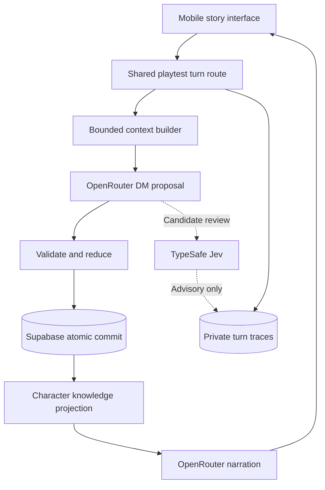

# Architecture

## Responsibilities

Next.js serves the mobile web app and open shared-playtest orchestration routes on Vercel. Supabase stores authoritative snapshots, accepted turns and traces. No player identity or authentication is required in this mode. A pure TypeScript reducer is portable and provider-independent. The LLM makes creative judgments and proposes structured changes; code validates and applies them. Database commits, not model output or chat history, define truth.

## Open shared access

The lobby lists all active and archived adventures. Anyone may create a run, resume an active one, reset it or delete a selected run after confirmation. Raw Supabase tables and internal RPCs remain inaccessible to browser roles: RLS stays enabled and anon/authenticated grants stay revoked. Application routes use the server key and return explicit player knowledge projections, never authoritative snapshots or private traces.

The historical `owner_id` UUID is an internal quota/serialization scope, decoupled from `auth.users`; it is not a player identity or access boundary in open mode. New campaigns use a shared scope. For an existing campaign, the server resolves its stored scope before invoking database functions, so earlier runs remain usable. Clients cannot supply their own scope to evade limits. The shared lobby permits five active campaigns and 100 turn attempts per day. Turn/narration leases and revision checks still apply. Concurrent visitors act on the same state; a stale proposal must fail instead of overwriting another turn.

Reset archives the original run and creates a new one from its stored seed with an idempotent reset ID. Delete removes the selected run and cascades to accepted turns and traces; an existing reset successor is a separate run. Neither operation requires a model call. UI confirmation is required for deletion, and deletion must not race an active turn or narration lease.

## State and history

The first version uses a JSONB campaign snapshot for a coherent transaction boundary, plus an append-only accepted-turn table. Entities, facts, rules, claims, quests and scheduled events have stable IDs. Facts have a canonical key, subjects, content, occurrence time, and explicit known-by character IDs. Facts cannot be overwritten. An existing fact's knowledge can grow. Claims have a speaker and their own audience and do not establish their content as truth.

Entity fields describe current state; updates are accepted operations in the event history. Items have one owner. Referential integrity, unique IDs/keys, valid owners, nondecreasing time, and event deadlines are checked by the reducer. Generated prose is never executed. Narrative rules are data supplied to the DM; schema/reducer validation cannot prove arbitrary prose consistency.

Future scaling: move growing facts/events into indexed tables and retrieve candidates by entity, place, time and full-text query. Keep a compact current-state snapshot. Never make an embedding summary authoritative.

## Turn protocol

1. Resolve the campaign and its internal scope server-side. No JWT or sign-in is required. Enforce input size and a database-backed turn lease/rate limit; archived runs reject new actions.
2. Check `(campaign_id, turn_id)` before a model call; return the previous result on retry. A reused ID with a different input is rejected.
3. Build bounded DM context: world seed and all applicable rules, player and scene entities, linked facts/claims, open quests, due events and a short recent outcome window. Log selected IDs and size. Fail closed when mandatory context cannot fit.
4. The DM returns clarification or an attempted-action interpretation, elapsed time and typed operations. At most one proposal call in the first slice; invalid proposals return a retryable failure without mutation. Never silently repair history.
5. Reduce on a clone. Reject invalid references, overwritten facts, invalid state transitions, unsupported operations and unresolved deadlines crossed by elapsed time. When configured, one OpenRouter Decisions request to Jev reviews the candidate and bounded context for intent/continuity. Its private results are advisory; a 4-second timeout or failure never changes the engine outcome.
6. Atomically lock/check snapshot revision and insert the accepted turn plus next snapshot. Concurrent stale proposals fail. Store the proposal, engine version and public outcome for replay. No external API call is inside the database transaction.
7. Return committed public changes first. Narration is a separate application request operating only on the committed public projection and outcome. It cannot change world state. The UI always has a deterministic fallback. Narration is persisted with bounded retries and its own lease.

Determinism means replay of accepted proposals from the original seed produces identical state. It does **not** mean AI interpretation is deterministic. First-slice adjudication has no dice; if introduced, persist rolls/seeds with the proposal.

## Living world without cron

Nothing happens computationally while the player is away. In-story actions advance time. The DM may develop relevant NPC goals and local dynamics within the turn's operation budget. Scheduled commitments have explicit due times and must resolve when crossed. On long travel/rest, include deadlines first; bound the allowed time jump to the configured maximum and use additional player turns if needed. Never silently skip commitments to meet a token budget.

Distant possibilities remain unmaterialized until relevant. They are constrained by established goals and history when materialized. This is selective story development, not a full offscreen simulation. No background job per NPC or campaign.

## Knowledge boundary

Authoritative state is not client-readable, even though the lobby and adventures are shared, because it contains spoilers. Tables have RLS and no client grants/policies for snapshots or traces. The server returns a deliberately constructed player view. The secret-informed DM interpretation and clarification text stay in private records; ambiguous turns return a fixed public-safe question. Public turn notes echo the player’s own attempt and list projected changes. Hidden facts, undiscovered entities, private rules and unresolved DM intentions never enter narration context. Known entities expose only identity/kind; descriptions, conditions, relationships and possessions are presented through known facts to avoid leaking changed offscreen attributes.

The narration prompt may add sensory connective prose but must not invent consequential facts. This prompt is a constraint, not a formal proof. Story fidelity evaluations and an eventual independent narrative checker are required before claiming strong semantic guarantees.

## Cost and latency

Default bounds: 2,000 input characters, 24,000 context characters, 20 operations, 720 in-story minutes, 1 proposal + 1 narration call on the normal path, with at most one explicit narration retry per accepted turn. No calls on inactivity. Provider token counts, model/version, prompt version, stage duration and selected context IDs are logged. OpenRouter-reported cost, served model/provider and generation IDs are recorded through a metadata allowlist; missing costs stay null. Raw provider errors and reasoning are excluded. TypeSafe adds at most one 4-second shadow call per proposal, with no retries. Its resolved model, finite probabilities and usage are logged privately; it cannot commit or veto state.

Two sequential model stages are intentional: narration cannot precede commitment. A visible committed outcome prevents a narration delay from making the game appear lost. Later optimize with streaming narration and measured caching, not speculative world mutation.

## First-slice limits

Snapshot loading is O(campaign size) even though model context is bounded. Lexical/entity context retrieval can miss distant relevant facts. Immutable keys block direct replacement but not a cleverly paraphrased contradiction. World-rule semantics remain model adjudication. Document and measure these gaps; the roadmap includes indexed retrieval, contradiction evaluation, and long campaign benchmarks.
